# Dashboards — user manual

For operators who use dashboards, and for whoever builds them in the manager.
Each section is one task. Words in *italics* are what you see on screen.
How dashboards work inside (for developers and support): [docs/dashboards.md](../dashboards.md).

1. [What a dashboard is](#1-what-a-dashboard-is)
2. [Opening a dashboard](#2-opening-a-dashboard)
3. [Reading a dashboard](#3-reading-a-dashboard)
4. [Using controls](#4-using-controls)
5. [Making a router dashboard](#5-making-a-router-dashboard)
6. [Placing widgets and choosing their values](#6-placing-widgets-and-choosing-their-values)
7. [Widget options and dashboard settings](#7-widget-options-and-dashboard-settings)
8. [Buttons: actions and steps](#8-buttons-actions-and-steps)
9. [Duplicating and copying](#9-duplicating-and-copying)
10. [Saving, conflicts and history](#10-saving-conflicts-and-history)
11. [Showing a dashboard on a router's screen](#11-showing-a-dashboard-on-a-routers-screen)
12. [When something looks wrong](#12-when-something-looks-wrong)
13. [Words used here](#13-words-used-here)

---

## 1. What a dashboard is

A dashboard is a page of controls and readings — faders, buttons, level
meters, status lights, graphs — laid out on a grid. Each control is tied to
one value of a router, such as a mic's level or whether it is muted.

There are two kinds:

- A **router dashboard** belongs to one router. It is kept with that
  router's profile and the router shows it itself, so it keeps working when
  the router cannot reach the manager.
- A **manager dashboard** can show several routers at once. It lives on the
  manager and only works through it.

The older *Local Control Panel* still runs beside dashboards for now.

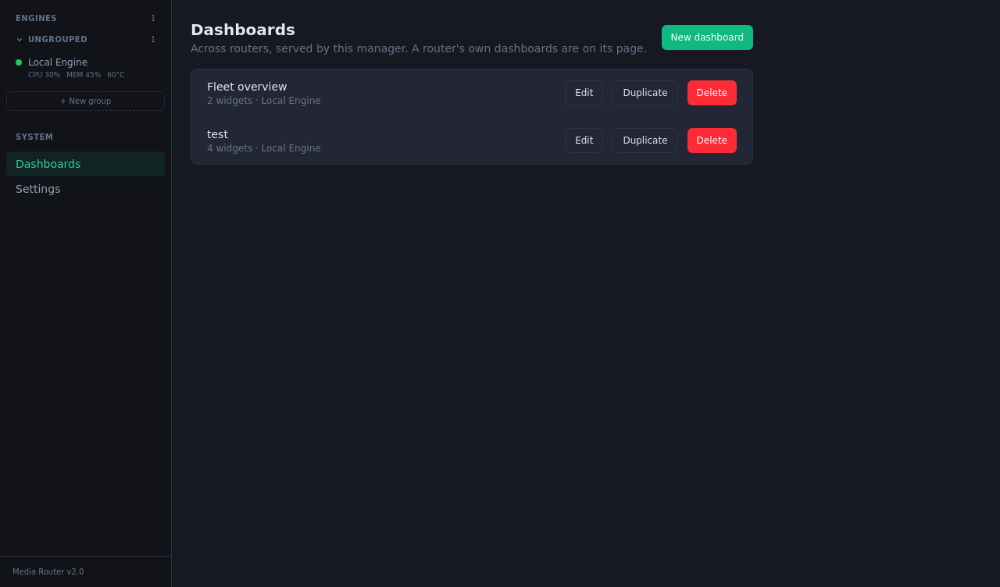
*The manager's Dashboards page lists manager dashboards; each router has its own list.*

## 2. Opening a dashboard

**In the manager:**

1. For a manager dashboard, click *Dashboards* under *System* in the side bar.
2. For a router dashboard, open *Engines*, click the router, then *Dashboards*
   (next to *Manage Profiles*).
3. Click a dashboard's name, or *Edit* to change it.

**On the router itself:** open `http://<router address>:8081/d/` in a browser.
It lists the router's dashboards; click one. A dashboard's own address is
`http://<router address>:8081/d/<name>`.

**On a router's screen:** see [section 11](#11-showing-a-dashboard-on-a-routers-screen).

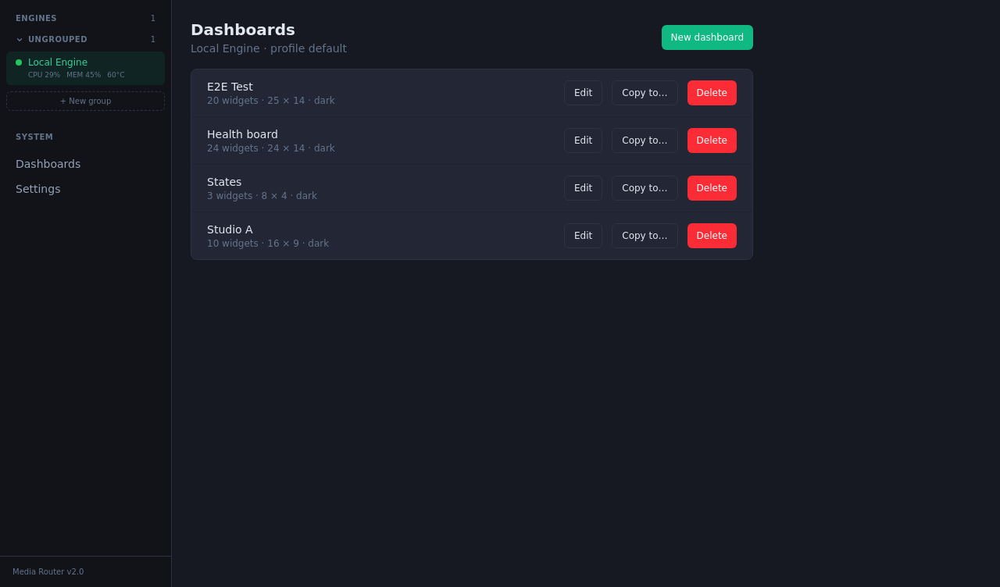
*A router's dashboards, with Edit, Copy to… and Delete for each.*

On a router that still runs an older version, this page says so: its
dashboards work in the manager, and appear on the router's own screen once
it is updated.

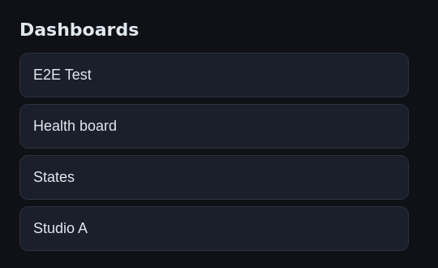
*The same list served by the router at `:8081/d/`.*

## 3. Reading a dashboard

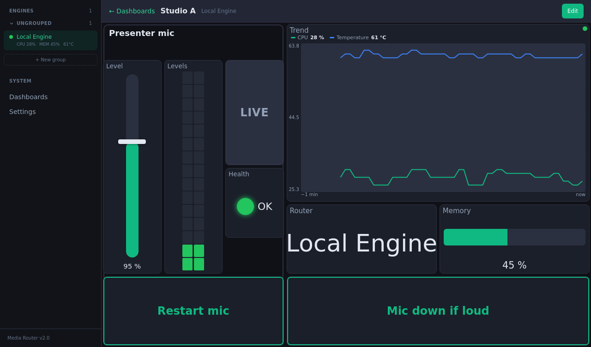
*A dashboard: a Fader and a VU meter in a Label / frame, a Toggle button for mute, a Status light, a Trend of CPU and temperature, a Readout, a Bar gauge and two Buttons.*

- **Values are live.** A change made anywhere — another dashboard, the
  routing view, the router's own screen — shows here within a moment.
- ***Missing*** (orange edge): the module this widget uses is not in the
  router's running profile — it was deleted, or another profile is active.
  The widget takes no input.
- ***Stale*** (greyed): the page lost its connection, or that router is
  offline. You see the last value; nothing can be changed until it is back.
- **The dot** in the top right corner shows the connection. **Tap it** to
  read why it has its colour.
  - Green: everything is connected.
  - Amber: it works, but something is missing. On a router's screen the
    manager is unreachable (changes are kept and sent when it is back); on a
    manager dashboard one of its routers is offline.
  - Red: no input at all.
- **The ≡ button** beside the dot lists the router's other dashboards (not on
  a locked dashboard).
- **A padlock** on a control means it is display only: the builder turned its
  input off, or the value cannot be changed.

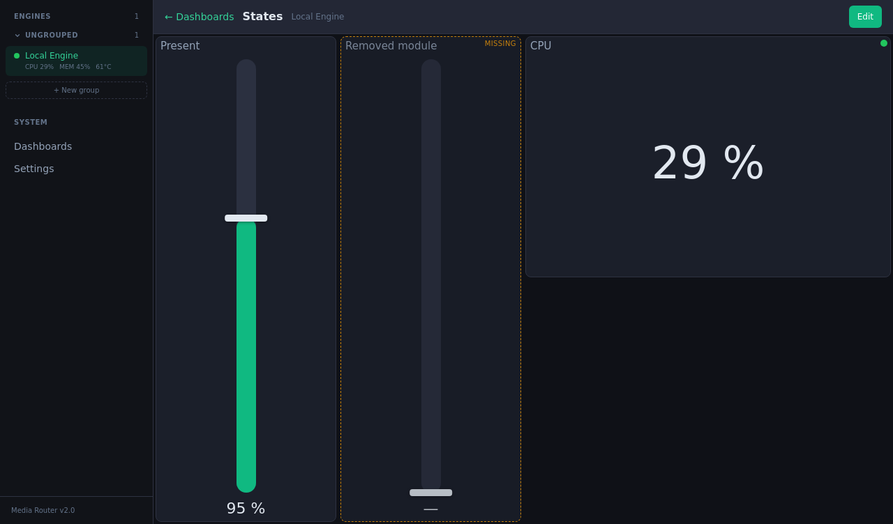
*The middle fader's module was removed: it shows Missing and takes no input.*

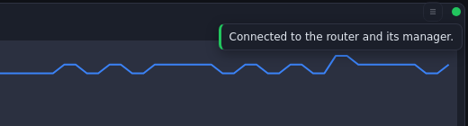
*A tap on the dot says why it is green.*

## 4. Using controls

- **Faders and sliders:** put your finger (or the mouse) on the control and
  drag. A tap alone changes nothing, so a brush against the screen is safe.
  With a keyboard: arrow keys move one step, Page Up/Down ten, Home/End to
  the ends.
- **Toggles** and **toggle buttons:** tap to switch. A *Toggle button* can light up
  when a value is *off* — for example *MUTED* when audio is disabled.
- **Number boxes:** tap − or +, or tap the number and type one.
- **Dropdowns:** pick a choice.
- **Buttons:** tap. Restart, Stop, Reset and Reboot ask *Yes* / *Cancel* first.
  A button that runs several steps shows its progress (*2/5 · tap to stop*);
  tapping it then asks *Stop the running actions?*. If a step fails, the
  button shows which one and why for a few seconds. With a mouse, point at it
  to read the whole message; on a touch screen only its start shows.
- **Mutes in a group (interlocks):** where only one source may be live,
  turning one on turns the others off at once, from any dashboard or screen.

Nothing you change is saved for later if the connection is lost: a control
only works while the dashboard is connected.

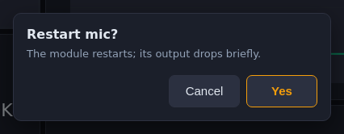
*Restart asks first.*

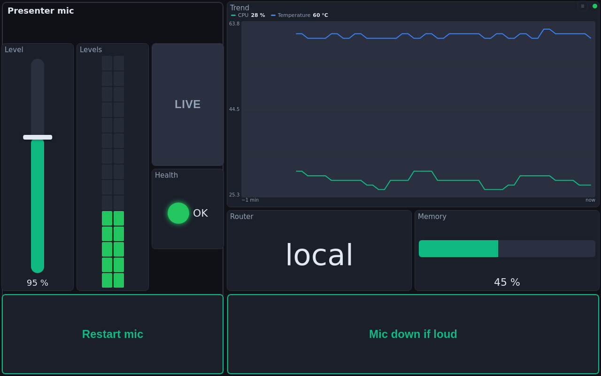
*The same dashboard on the router at `:8081/d/Studio A`; the ≡ button beside the dot lists the other dashboards.*

## 5. Making a router dashboard

1. Open the router's *Dashboards* (section 2).
2. Click *New dashboard*, type a name and click *Create*. The name is also
   the end of its address (`/d/<name>`), so keep it short.
3. The editor opens. Add widgets (section 6), then click *Save*.

Dashboards are edited only in the manager. *Save* publishes all your changes
at once; *Cancel* drops them — with changes made it asks *Discard changes?*
first.

For a manager dashboard, do the same from *Dashboards* under *System*.

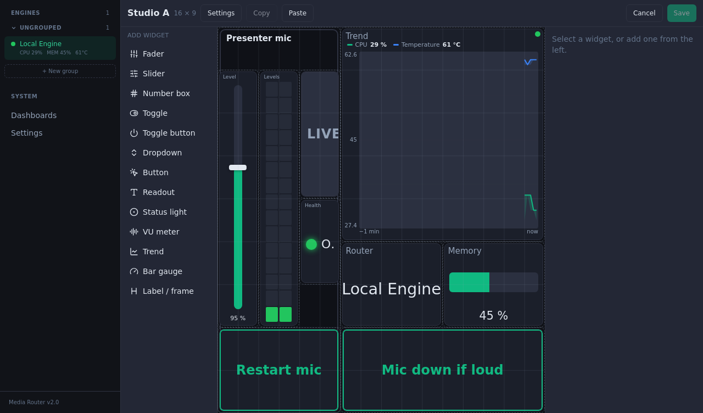
*The editor: the widget list on the left, the grid, and the selected widget's settings on the right.*

## 6. Placing widgets and choosing their values

1. Click a widget kind in the list on the left. It appears on the grid. The
   kinds: *Fader*, *Slider*, *Number box*, *Toggle*, *Toggle button*,
   *Dropdown*, *Button*, *Readout*, *Status light*, *VU meter* (levels),
   *Trend* (a graph over time), *Bar gauge* and *Label / frame*.
2. Drag it where you want it; drag its corner to resize. Arrow keys move the
   selected widgets one cell.
3. On the right, click *Choose value…*. Pick the router (on a manager
   dashboard), then the module — type in *Search modules* to find it — or
   *Router* for the router's own values (name, CPU, memory, temperature,
   running), then the value. *Clear* unties the widget.

The list only offers values the widget can show: a *Fader* needs a number
with a range, a *Status light* on/off or a health state, a *VU meter* a module
that carries audio; a *Trend* takes up to 8 numbers (*Add value…*).

To delete, select and press Delete, or right-click and choose *Delete*.
Ctrl+C / Ctrl+V copy and paste, Escape clears the selection.
*To front* / *To back* decide which widget is drawn on top.

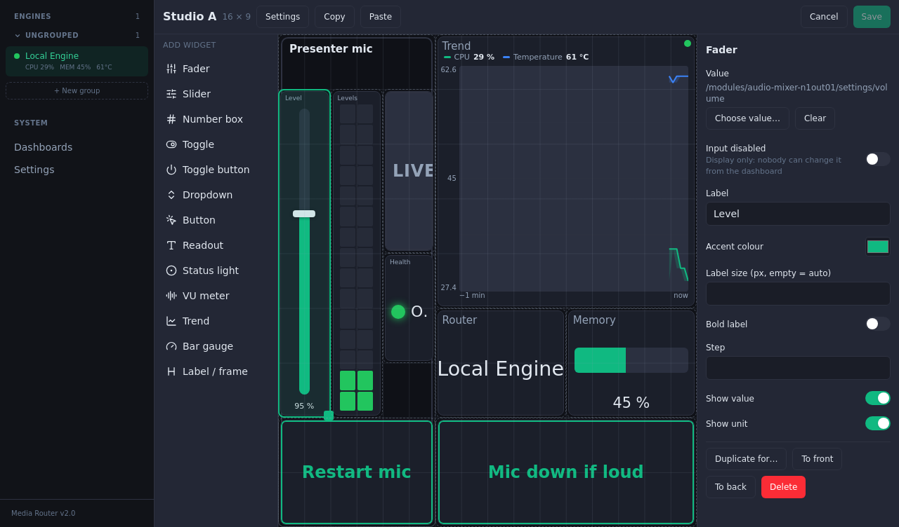
*A fader selected: its value, Input disabled, label and its own options.*

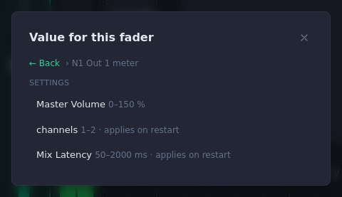
*Choosing a value: after the module (here N1 Out 1 meter), its values.*

## 7. Widget options and dashboard settings

Every widget has a *Label* (its title), an *Accent colour*, a label size and
*Bold label*. Widgets that take input also have *Input disabled*, which makes
them display only. Each kind adds its own: a *Fader*'s step, a *Trend*'s
*Time shown* (1, 5, 15 or 60 minutes) and fixed minimum/maximum, a
*Readout*'s decimals and *Wrap long text*, a *Toggle button*'s texts and
colour, a *Label / frame*'s orientation and alignment.

Click *Settings* in the editor's top bar for the dashboard itself:

- *Columns* and *Rows* of the grid.
- *Scroll* off: the dashboard always fits the screen. On: fixed-size cells,
  the page scrolls.
- *Pinch zoom*: pinch or Ctrl+wheel zooms, drag the background to move, a
  double tap resets.
- *Locked*: no dashboard menu on screen, so a touch panel stays on this one.
- *Theme*: Dark or Light.

Viewers cannot change these; they are part of the dashboard.

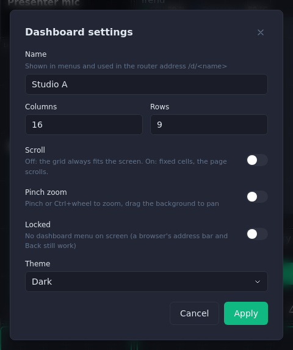
*Dashboard settings.*

## 8. Buttons: actions and steps

A button does one or more things when pressed. Select it in the editor and,
under *Actions*:

1. Click *+ Add…* and choose *Action* (restart a module, start or stop all
   modules, reset or reboot the router, set a value) or *Wait*.
2. Add more steps; they run in order. The arrows move a step, × removes it.
3. For more than a list, add *If … then … otherwise*, *Repeat N times*,
   *Repeat until …*, *Wait until …*, *Set a value to a calculation* or *Stop*.
   Values can be compared and calculated (+ − × ÷, = ≠ < > ≤ ≥, and, or,
   not). *Wait until …* has *Give up after (s)*: the run fails if it waits
   longer.
4. *Open editor…* shows the steps in a large window.
5. *Max run time* stops a run that takes too long (60 s unless you change it).

The steps run on the router (or the manager, for a manager dashboard), so
closing the page does not stop them. A run stops at the first step that
fails. *Ask to confirm* asks before it starts: it is on by default for
Restart, Stop, Reset and Reboot — switch it off if you don't want the
question.

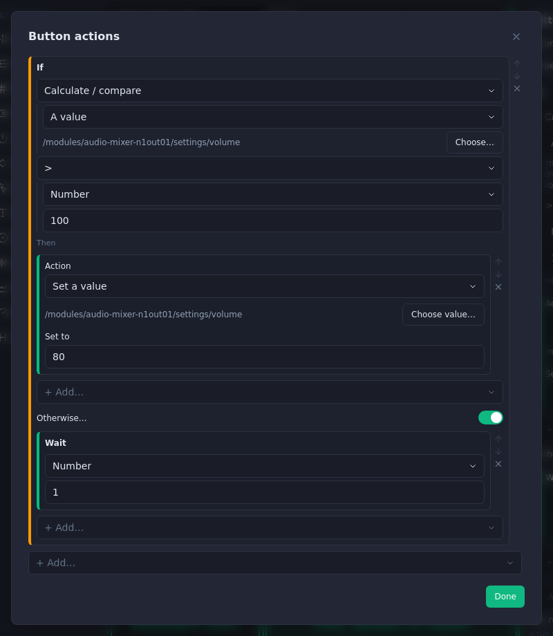
*A button that lowers the mic when it is above 100 %, otherwise waits.*

## 9. Duplicating and copying

- ***Duplicate for…*** (selected widgets): copies them for another module —
  build one mic's strip, then duplicate it for each other mic.
- ***Copy*** / ***Paste*** in the editor's top bar: copies selected widgets,
  also into another dashboard.
- ***Copy to…*** (a router's dashboard list): copies a whole dashboard to
  another router or profile. It matches each module by name, then by kind;
  check the matches before *Copy*. A module set to *— not mapped —* leaves
  its widgets showing *Missing* there.
- ***Duplicate*** (the manager's dashboard list): copies a manager dashboard.

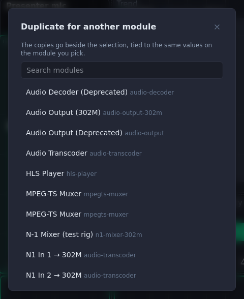
*Duplicate for… asks which module the copies are for.*

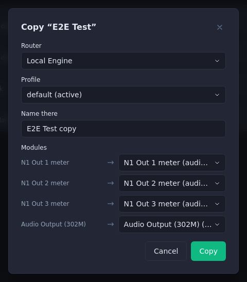
*Copy to… with the module matches, here for the "E2E Test" dashboard.*

## 10. Saving, conflicts and history

If someone else saved the same dashboard while you were editing, *Save* asks
what to do: *Overwrite* (yours wins) or *Load theirs* (your edits are dropped).

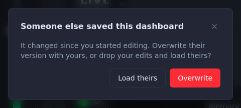
*Someone else saved meanwhile.*

**Manager dashboards** keep their last 10 versions, at most one per 10
minutes: open the dashboard, click *History*, click *Restore* on a version,
then *Restore it* to confirm.

**Router dashboards** are part of the router's profile: restoring an older
profile version (*Manage Profiles*) brings back its dashboards too.

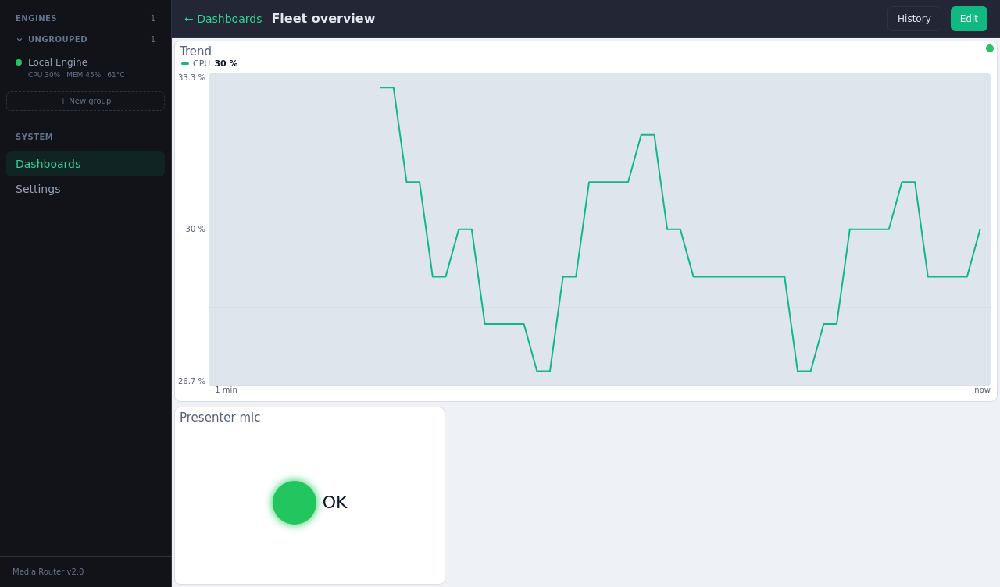
*A manager dashboard in the Light theme, with History.*

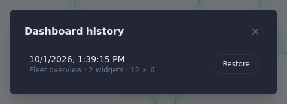
*A manager dashboard's history.*

## 11. Showing a dashboard on a router's screen

On the router's own setup page (device-manager), open *Displays*:

1. For the screen you want, set *Content* to *Dashboard*.
2. Pick the dashboard from the list of the running profile's dashboards.
   *Dashboard list* shows the list itself on the screen. For a dashboard of
   another profile, choose *Other name…* and type its name (*Back to the
   list* returns). If the list cannot be loaded, a text box appears instead:
   type the name exactly as it is in the manager.
3. Save. The screen opens `/d/<name>`.

When the router switches profile, the screen shows the new profile's
dashboard of the same name, or the list of its dashboards.

Tip: turn on *Locked* in the dashboard's settings for a screen that should
always show the same dashboard.

## 12. When something looks wrong

| What you see | What it means | What to do |
|---|---|---|
| A widget says *Missing* | Its module is not in the running profile | Bind it to another value, or switch the router to the profile that has the module |
| Everything is greyed, *Stale*, the dot is red | The page lost its connection, or the router is offline | Check the router and the network; the page reconnects by itself |
| The dot is amber on the router's screen | The router cannot reach its manager | The screen still works; changes are sent when the manager is back |
| A fader shows *No range* | The value has no range, so it cannot be dragged | Use a number box or readout for that value |
| A button says *Step 2: …* in red | That step failed; the run stopped there | Point at the button with a mouse to read the whole message |
| Displays says it couldn't load the router's dashboard list | The router's engine did not answer | Type the name in the text box shown instead |
| `:8081/d/` says *Dashboard viewer not built* | The router's install lacks the dashboard page | Update the router |

## 13. Words used here

- **Widget** — one control or reading on a dashboard.
- **Value** — one setting or reading of a router or module, e.g. *Master Volume*.
- **Module** — one processing block on a router (an input, mixer, encoder…).
- **Profile** — a router's saved setup; one is running at a time.
- **Input disabled** — the widget shows its value but cannot change it.
- **Interlock** — a group of sources of which only one may be live.
- **Stale** — showing the last known value while disconnected.
- **Missing** — the widget's module is not there.
